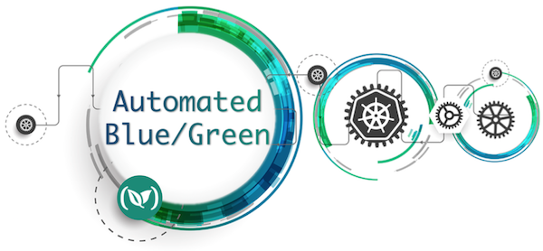
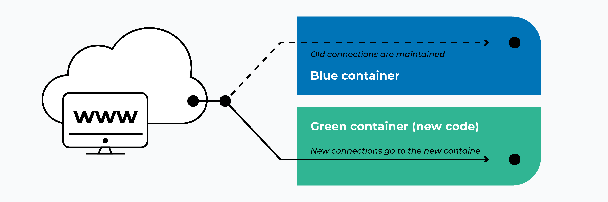

# k8s-blue-green-deploy
This project contains sample script to guide one with the steps for performing blue green container deployment on k8s Okteto using jenkins

# *Blue-Green-Deployment*

### _What is blue/green deployment?_
Blue/green deployment is a continuous deployment process that reduces downtime and risk by having two identical production environments, called blue and green. (The names blue and green aren’t special or important – this process is also called red/black deployment or A/B deployment.)

### _Benefits_
- Simple rollouts
- Quick rollbacks
- Easy disaster recovery.

### Drawbacks
- Running two envs can be expensive
- Database problem - while pushing only one of them live

# *Lets get started*

This is a simple project to demonstate the power of blue/green deployment model and to illustrate the steps to implement it in K8S _Oketato_ using Jenkins.

## Pre-requisite

In order to effectively use this script, we need following components to be installed prior running this script:

- Docker
- K8S
- Okteto
- Okteto cli
- Git

#### Flow Diagram

## Follow-Me

